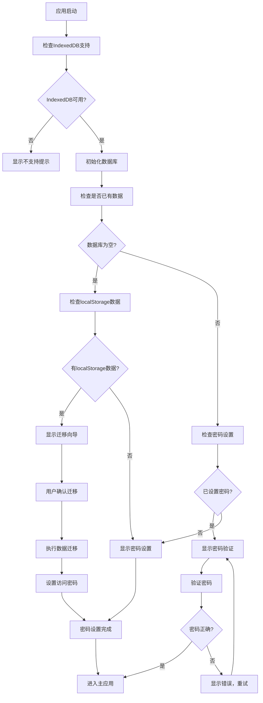
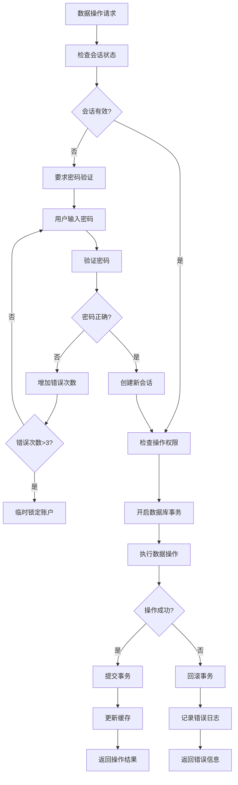
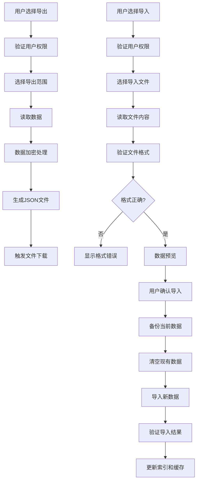
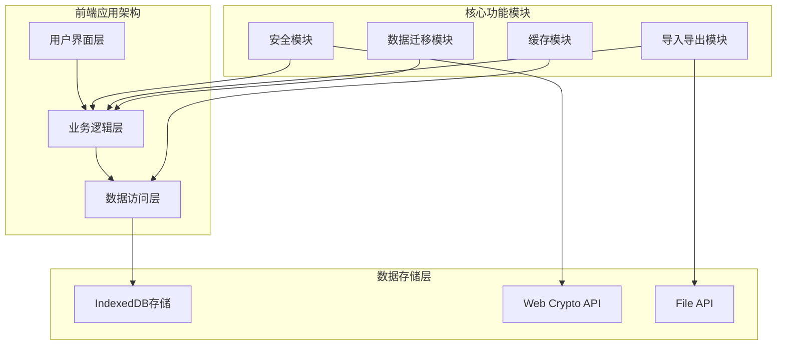
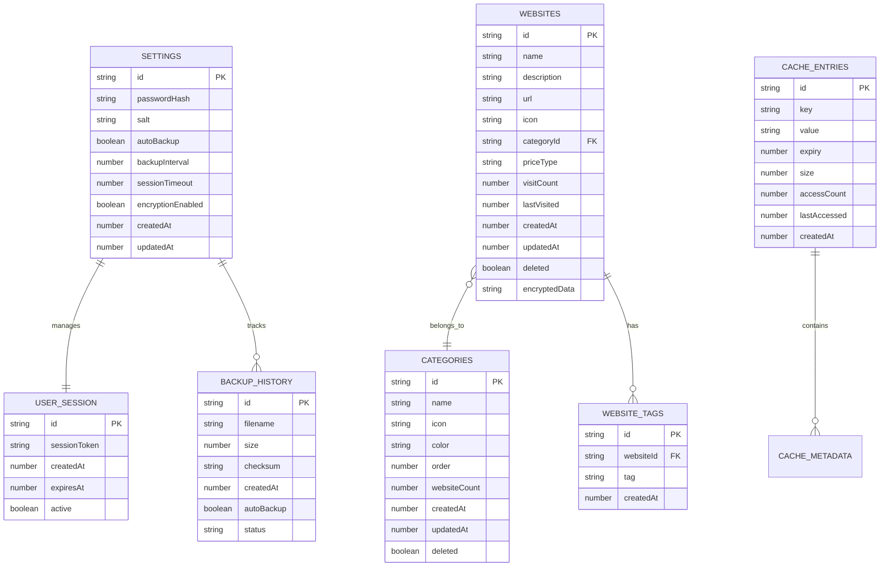

# IndexedDB技术实现方案

## 1. 技术概述

本文档详细描述了将现有localStorage数据存储迁移到IndexedDB的具体技术实现方案，包括完整的代码架构、API设计和实现细节。

* **目标**：构建安全、高效、稳定的本地数据存储解决方案

* **核心技术**：IndexedDB + Web Crypto API + 现代JavaScript ES6+

* **预期收益**：提升数据安全性、存储容量和操作性能

### 1.2 核心目标

- **数据迁移**：平滑地将localStorage数据迁移到IndexedDB
- **密码保护**：实现本地数据的密码保护和加密存储
- **导入导出**：提供完整的数据备份和恢复功能
- **性能优化**：提升数据存储和检索的性能
- **稳定性**：确保本地数据存储的可靠性和一致性

## 2. 核心功能

### 2.1 用户角色

| 角色    | 权限说明   | 核心功能                  |
| ----- | ------ | --------------------- |
| 数据管理员 | 完全访问权限 | 设置密码、管理所有数据、导入导出、系统设置 |
| 访客用户  | 只读权限   | 需要密码验证后才能查看数据，无法修改    |

### 2.2 功能模块

我们的IndexedDB实现方案包含以下核心页面：

1. **密码管理页面**：密码设置、验证、修改功能
2. **数据迁移页面**：从localStorage自动迁移数据
3. **数据管理页面**：导入导出、备份恢复功能
4. **系统设置页面**：安全设置、存储配置

### 2.3 页面详情

| 页面名称   | 模块名称   | 功能描述                    |
| ------ | ------ | ----------------------- |
| 密码管理页面 | 密码设置模块 | 首次设置密码、密码强度验证、确认密码输入    |
| 密码管理页面 | 密码验证模块 | 用户登录验证、错误次数限制、会话管理      |
| 密码管理页面 | 密码修改模块 | 旧密码验证、新密码设置、安全确认        |
| 数据迁移页面 | 迁移检测模块 | 检测localStorage数据、显示迁移预览 |
| 数据迁移页面 | 迁移执行模块 | 执行数据迁移、进度显示、错误处理        |
| 数据迁移页面 | 迁移验证模块 | 验证迁移结果、数据完整性检查          |
| 数据管理页面 | 导出功能模块 | 选择导出范围、生成JSON文件、下载管理    |
| 数据管理页面 | 导入功能模块 | 文件选择、格式验证、数据预览、确认导入     |
| 数据管理页面 | 备份管理模块 | 自动备份设置、备份历史、恢复操作        |
| 系统设置页面 | 安全设置模块 | 密码策略、会话超时、加密选项          |
| 系统设置页面 | 存储管理模块 | 存储空间查看、数据清理、性能优化        |
| 系统设置页面 | 数据统计模块 | 显示存储使用情况和数据统计信息         |

## 3. 核心流程

### 3.1 数据迁移流程

1. **检测现有数据**：扫描localStorage中的数据
2. **数据验证**：验证数据完整性和格式
3. **创建IndexedDB**：初始化数据库和对象存储
4. **数据转换**：将localStorage数据转换为IndexedDB格式
5. **批量导入**：分批将数据导入IndexedDB
6. **验证迁移**：确认数据迁移的完整性
7. **清理旧数据**：可选择性清理localStorage数据
8. **完成迁移**：更新应用配置，切换到IndexedDB存储

### 3.4 密码保护流程

1. **密码设置**：用户首次设置访问密码
2. **密钥生成**：基于密码生成加密密钥
3. **数据加密**：使用AES算法加密敏感数据
4. **安全存储**：将加密数据存储到IndexedDB
5. **身份验证**：用户访问时验证密码
6. **数据解密**：验证成功后解密数据供使用
7. **会话管理**：管理用户登录会话和超时
8. **密码更新**：支持用户修改密码和重新加密数据

### 3.2 系统初始化和数据迁移流程



### 3.3 数据操作和安全验证流程



### 3.4 导入导出和备份流程



## 4. 用户界面设计

### 4.1 设计风格

* **主色调**：#3b82f6（主蓝色）、#10b981（成功绿）、#ef4444（警告红）、#f59e0b（提示黄）

* **按钮样式**：圆角8px，渐变背景，悬停效果，阴影深度2px

* **字体规范**：标题18px粗体，正文14px常规，小字12px

* **布局风格**：卡片式布局，16px内边距，24px外边距

* **图标风格**：线性图标配合Emoji，统一16px尺寸

### 4.2 页面设计概览

| 页面名称   | 模块名称   | UI元素                       |
| ------ | ------ | -------------------------- |
| 密码设置页面 | 密码输入区域 | 居中卡片布局，密码强度指示器，实时验证提示，渐变背景 |
| 密码验证页面 | 登录表单   | 简洁登录框，记住密码选项，错误提示动画，品牌Logo |
| 数据迁移页面 | 迁移向导   | 步骤指示器，数据预览表格，进度条动画，操作按钮组   |
| 数据管理页面 | 导入导出区域 | 拖拽上传区域，操作按钮网格，文件预览，状态指示灯   |
| 系统设置页面 | 设置面板   | 分组设置卡片，开关切换器，滑块控件，保存确认弹窗   |

### 4.3 响应式设计

* **桌面优先**：主要针对1200px+宽屏设计，充分利用空间

* **平板适配**：768px-1199px断点，调整布局密度和字体大小

* **移动优化**：<768px断点，单列布局，大按钮设计，触摸友好

## 5. 技术架构

### 5.1 架构设计



### 5.2 技术栈

#### 5.2.1 核心技术

- **IndexedDB**：浏览器原生的NoSQL数据库
- **Web Crypto API**：浏览器原生的加密API
- **JavaScript ES6+**：现代JavaScript语法和特性
- **Promise/async-await**：异步编程模式

#### 5.2.2 辅助技术

- **JSON**：数据序列化和反序列化
- **Blob API**：文件处理和下载
- **File API**：文件上传和读取
- **LocalStorage**：临时存储和配置管理

#### 5.2.3 开发工具

- **现代浏览器**：支持IndexedDB和Web Crypto API
- **开发者工具**：调试和性能分析
- **测试框架**：单元测试和集成测试
- **性能监控**：存储性能和内存使用监控

### 5.3 技术描述

* **前端**：原生JavaScript ES2020 + IndexedDB API + Web Crypto API

* **UI框架**：无外部依赖，纯原生DOM操作和CSS3动画

* **加密库**：Web Crypto API（AES-GCM + PBKDF2）

* **文件处理**：File API + Blob API + URL.createObjectURL

### 5.3 路由定义

| 路由        | 用途                       |
| --------- | ------------------------ |
| /setup    | 首次设置页面，引导用户设置密码和迁移数据     |
| /login    | 密码验证页面，用户身份认证            |
| /migrate  | 数据迁移页面，从localStorage迁移数据 |
| /manage   | 数据管理页面，导入导出和备份功能         |
| /settings | 系统设置页面，安全和同步配置           |
| /main     | 主应用页面，正常的导航网站功能          |

## 6. API定义

### 6.1 核心数据库API

**数据库管理类**

```typescript
class NavigationDB {
    // 数据库初始化
    async init(): Promise<void>
    
    // 密码管理
    async setPassword(password: string): Promise<boolean>
    async verifyPassword(password: string): Promise<boolean>
    async changePassword(oldPassword: string, newPassword: string): Promise<boolean>
    async hasPassword(): Promise<boolean>
    
    // 网站数据操作
    async getWebsites(category?: string): Promise<Website[]>
    async addWebsite(website: Website): Promise<string>
    async updateWebsite(id: string, website: Partial<Website>): Promise<boolean>
    async deleteWebsite(id: string): Promise<boolean>
    async searchWebsites(query: string): Promise<Website[]>
    
    // 分类数据操作
    async getCategories(): Promise<Category[]>
    async addCategory(category: Category): Promise<string>
    async updateCategory(id: string, category: Partial<Category>): Promise<boolean>
    async deleteCategory(id: string): Promise<boolean>
    
    // 缓存管理
    async getCache(key: string): Promise<any>
    async setCache(key: string, value: any, expiry?: number): Promise<void>
    async clearCache(): Promise<void>
    async clearExpiredCache(): Promise<void>
    
    // 数据迁移
    async migrateFromLocalStorage(): Promise<MigrationResult>
    async checkMigrationNeeded(): Promise<boolean>
    
    // 导入导出
    async exportData(options?: ExportOptions): Promise<string>
    async importData(jsonData: string, options?: ImportOptions): Promise<ImportResult>
    
    // 备份管理
    async createBackup(): Promise<string>
    async restoreBackup(backupData: string): Promise<boolean>
    async getBackupHistory(): Promise<BackupInfo[]>
    
    // 统计信息
    async getStorageInfo(): Promise<StorageInfo>
    async getDataStats(): Promise<DataStats>
}
```

**数据类型定义**

```typescript
interface Website {
    id: string;
    name: string;
    description: string;
    url: string;
    icon: string;
    category: string;
    priceType: 'free' | 'paid' | 'freemium';
    createdAt: number;
    updatedAt: number;
    deleted: boolean;
}

interface Category {
    id: string;
    name: string;
    icon: string;
    order: number;
    createdAt: number;
    updatedAt: number;
    deleted: boolean;
}

interface Settings {
    id: string;
    passwordHash: string;
    salt: string;
    autoBackup: boolean;
    backupInterval: number;
    lastBackup: number;
    sessionTimeout: number;
    encryptionEnabled: boolean;
    createdAt: number;
    updatedAt: number;
}

interface MigrationResult {
    success: boolean;
    websitesCount: number;
    categoriesCount: number;
    errors: string[];
}

interface ImportResult {
    success: boolean;
    imported: {
        websites: number;
        categories: number;
    };
    skipped: number;
    errors: string[];
}

interface StorageInfo {
    used: number;
    available: number;
    total: number;
    percentage: number;
}

interface DataStats {
    websites: number;
    categories: number;
    lastUpdated: number;
    totalSize: number;
}
```

### 6.2 安全加密API

**加密工具类**

```typescript
class CryptoUtils {
    // 密码哈希
    static async hashPassword(password: string, salt: Uint8Array): Promise<string>
    static generateSalt(): Uint8Array
    static async verifyPassword(password: string, hash: string, salt: Uint8Array): Promise<boolean>
    
    // 数据加密
    static async encryptData(data: string, password: string): Promise<EncryptedData>
    static async decryptData(encryptedData: EncryptedData, password: string): Promise<string>
    
    // 密钥管理
    static async deriveKey(password: string, salt: Uint8Array): Promise<CryptoKey>
    static async generateIV(): Promise<Uint8Array>
    
    // 数据完整性
    static async calculateHash(data: string): Promise<string>
    static async verifyHash(data: string, hash: string): Promise<boolean>
}

interface EncryptedData {
    data: string;
    iv: string;
    salt: string;
    algorithm: string;
}
```

### 6.3 导入导出API

**数据管理工具类**

```typescript
class DataManager {
    // 文件操作
    static async exportToFile(data: any, filename: string): Promise<void>
    static async importFromFile(file: File): Promise<any>
    
    // 数据验证
    static validateImportData(data: any): ValidationResult
    static sanitizeImportData(data: any): any
    
    // 格式转换
    static convertToExportFormat(websites: Website[], categories: Category[]): ExportData
    static convertFromImportFormat(data: any): { websites: Website[], categories: Category[] }
    
    // 备份管理
    static async createAutoBackup(): Promise<string>
    static async scheduleBackup(interval: number): Promise<void>
    static async cleanOldBackups(keepCount: number): Promise<void>
}

interface ExportData {
    version: string;
    timestamp: number;
    websites: Website[];
    categories: Category[];
    metadata: {
        totalWebsites: number;
        totalCategories: number;
        exportedBy: string;
    };
}

interface ValidationResult {
    valid: boolean;
    errors: string[];
    warnings: string[];
}
```

## 7. 数据模型

### 7.1 数据模型定义



### 7.2 数据定义语言

**IndexedDB数据库创建脚本**

```javascript
// 数据库版本和配置
const DB_NAME = 'NavigationDB';
const DB_VERSION = 1;
const STORES = {
    SETTINGS: 'settings',
    WEBSITES: 'websites', 
    CATEGORIES: 'categories',
    CACHE: 'cache',
    BACKUPS: 'backups',
    SESSIONS: 'sessions'
};

// 数据库初始化函数
function initDatabase() {
    return new Promise((resolve, reject) => {
        const request = indexedDB.open(DB_NAME, DB_VERSION);
        
        request.onerror = () => reject(request.error);
        request.onsuccess = () => resolve(request.result);
        
        request.onupgradeneeded = (event) => {
            const db = event.target.result;
            
            // 创建设置存储
            if (!db.objectStoreNames.contains(STORES.SETTINGS)) {
                const settingsStore = db.createObjectStore(STORES.SETTINGS, { keyPath: 'id' });
            }
            
            // 创建网站存储
            if (!db.objectStoreNames.contains(STORES.WEBSITES)) {
                const websitesStore = db.createObjectStore(STORES.WEBSITES, { keyPath: 'id' });
                websitesStore.createIndex('categoryId', 'categoryId', { unique: false });
                websitesStore.createIndex('name', 'name', { unique: false });
                websitesStore.createIndex('url', 'url', { unique: false });
                websitesStore.createIndex('updatedAt', 'updatedAt', { unique: false });

                websitesStore.createIndex('deleted', 'deleted', { unique: false });
            }
            
            // 创建分类存储
            if (!db.objectStoreNames.contains(STORES.CATEGORIES)) {
                const categoriesStore = db.createObjectStore(STORES.CATEGORIES, { keyPath: 'id' });
                categoriesStore.createIndex('name', 'name', { unique: true });
                categoriesStore.createIndex('order', 'order', { unique: false });
                categoriesStore.createIndex('deleted', 'deleted', { unique: false });
            }
            
            // 创建缓存存储
            if (!db.objectStoreNames.contains(STORES.CACHE)) {
                const cacheStore = db.createObjectStore(STORES.CACHE, { keyPath: 'id' });
                cacheStore.createIndex('key', 'key', { unique: true });
                cacheStore.createIndex('expiry', 'expiry', { unique: false });
                cacheStore.createIndex('lastAccessed', 'lastAccessed', { unique: false });
            }
            
            // 创建备份历史存储
            if (!db.objectStoreNames.contains(STORES.BACKUPS)) {
                const backupsStore = db.createObjectStore(STORES.BACKUPS, { keyPath: 'id' });
                backupsStore.createIndex('createdAt', 'createdAt', { unique: false });
                backupsStore.createIndex('autoBackup', 'autoBackup', { unique: false });
            }
            

            
            // 创建会话存储
            if (!db.objectStoreNames.contains(STORES.SESSIONS)) {
                const sessionsStore = db.createObjectStore(STORES.SESSIONS, { keyPath: 'id' });
                sessionsStore.createIndex('expiresAt', 'expiresAt', { unique: false });
                sessionsStore.createIndex('active', 'active', { unique: false });
            }
        };
    });
}

// 初始数据插入
async function insertInitialData(db) {
    const transaction = db.transaction([STORES.SETTINGS, STORES.CATEGORIES], 'readwrite');
    
    // 插入默认设置
    const settingsStore = transaction.objectStore(STORES.SETTINGS);
    const defaultSettings = {
        id: 'main',
        passwordHash: null,
        salt: null,
        autoBackup: true,
        backupInterval: 7 * 24 * 60 * 60 * 1000, // 7天
        sessionTimeout: 30 * 60 * 1000, // 30分钟
        encryptionEnabled: true,

        createdAt: Date.now(),
        updatedAt: Date.now()
    };
    await settingsStore.add(defaultSettings);
    
    // 插入默认分类
    const categoriesStore = transaction.objectStore(STORES.CATEGORIES);
    const defaultCategories = [
        {
            id: 'all',
            name: '全部',
            icon: '📋',
            color: '#3b82f6',
            order: 0,
            websiteCount: 0,
            createdAt: Date.now(),
            updatedAt: Date.now(),
            deleted: false,
            syncStatus: 'synced'
        },
        {
            id: 'search',
            name: '搜索引擎',
            icon: '🔍',
            color: '#10b981',
            order: 1,
            websiteCount: 0,
            createdAt: Date.now(),
            updatedAt: Date.now(),
            deleted: false,
            syncStatus: 'synced'
        },
        {
            id: 'social',
            name: '社交媒体',
            icon: '💬',
            color: '#f59e0b',
            order: 2,
            websiteCount: 0,
            createdAt: Date.now(),
            updatedAt: Date.now(),
            deleted: false,
            syncStatus: 'synced'
        }
    ];
    
    for (const category of defaultCategories) {
        await categoriesStore.add(category);
    }
    
    return new Promise((resolve, reject) => {
        transaction.oncomplete = () => resolve();
        transaction.onerror = () => reject(transaction.error);
    });
}
```

## 8. 实现细节

### 8.1 核心类实现

**NavigationDB核心实现**

```javascript
class NavigationDB {
    constructor() {
        this.db = null;
        this.isInitialized = false;
        this.currentSession = null;
    }
    
    async init() {
        if (this.isInitialized) return;
        
        try {
            this.db = await initDatabase();
            
            // 检查是否需要插入初始数据
            const hasSettings = await this.hasSettings();
            if (!hasSettings) {
                await insertInitialData(this.db);
            }
            
            // 清理过期缓存和会话
            await this.clearExpiredCache();
            await this.clearExpiredSessions();
            
            this.isInitialized = true;
            console.log('NavigationDB initialized successfully');
        } catch (error) {
            console.error('Failed to initialize NavigationDB:', error);
            throw error;
        }
    }
    
    async hasSettings() {
        const transaction = this.db.transaction([STORES.SETTINGS], 'readonly');
        const store = transaction.objectStore(STORES.SETTINGS);
        const request = store.get('main');
        
        return new Promise((resolve, reject) => {
            request.onsuccess = () => resolve(!!request.result);
            request.onerror = () => reject(request.error);
        });
    }
    
    async setPassword(password) {
        try {
            const salt = CryptoUtils.generateSalt();
            const passwordHash = await CryptoUtils.hashPassword(password, salt);
            
            const transaction = this.db.transaction([STORES.SETTINGS], 'readwrite');
            const store = transaction.objectStore(STORES.SETTINGS);
            
            const settings = await this.getSettings();
            settings.passwordHash = passwordHash;
            settings.salt = Array.from(salt); // 转换为数组存储
            settings.updatedAt = Date.now();
            
            await store.put(settings);
            
            return new Promise((resolve, reject) => {
                transaction.oncomplete = () => resolve(true);
                transaction.onerror = () => reject(transaction.error);
            });
        } catch (error) {
            console.error('Failed to set password:', error);
            return false;
        }
    }
    
    async verifyPassword(password) {
        try {
            const settings = await this.getSettings();
            if (!settings.passwordHash || !settings.salt) {
                return false;
            }
            
            const salt = new Uint8Array(settings.salt);
            const isValid = await CryptoUtils.verifyPassword(password, settings.passwordHash, salt);
            
            if (isValid) {
                // 创建新会话
                await this.createSession();
            }
            
            return isValid;
        } catch (error) {
            console.error('Failed to verify password:', error);
            return false;
        }
    }
    
    async createSession() {
        const sessionId = this.generateId();
        const sessionToken = await CryptoUtils.generateSessionToken();
        const settings = await this.getSettings();
        
        const session = {
            id: sessionId,
            sessionToken,
            createdAt: Date.now(),
            expiresAt: Date.now() + settings.sessionTimeout,
            active: true
        };
        
        const transaction = this.db.transaction([STORES.SESSIONS], 'readwrite');
        const store = transaction.objectStore(STORES.SESSIONS);
        await store.add(session);
        
        this.currentSession = session;
        
        // 设置自动过期清理
        setTimeout(() => {
            this.clearExpiredSessions();
        }, settings.sessionTimeout);
        
        return sessionToken;
    }
    
    async getWebsites(category = null) {
        const transaction = this.db.transaction([STORES.WEBSITES], 'readonly');
        const store = transaction.objectStore(STORES.WEBSITES);
        
        let request;
        if (category && category !== '全部') {
            const index = store.index('categoryId');
            request = index.getAll(category);
        } else {
            request = store.getAll();
        }
        
        return new Promise((resolve, reject) => {
            request.onsuccess = () => {
                const websites = request.result.filter(site => !site.deleted);
                resolve(websites);
            };
            request.onerror = () => reject(request.error);
        });
    }
    
    async addWebsite(websiteData) {
        const website = {
            id: this.generateId(),
            ...websiteData,
            visitCount: 0,
            lastVisited: null,
            createdAt: Date.now(),
            updatedAt: Date.now(),
            deleted: false,
            syncStatus: 'pending'
        };
        
        const transaction = this.db.transaction([STORES.WEBSITES, STORES.CATEGORIES], 'readwrite');
        const websitesStore = transaction.objectStore(STORES.WEBSITES);
        const categoriesStore = transaction.objectStore(STORES.CATEGORIES);
        
        // 添加网站
        await websitesStore.add(website);
        
        // 更新分类计数
        const category = await categoriesStore.get(website.categoryId);
        if (category) {
            category.websiteCount = (category.websiteCount || 0) + 1;
            category.updatedAt = Date.now();
            await categoriesStore.put(category);
        }
        
        // 添加到同步队列
        await this.addToSyncQueue('website', website.id, 'create', website);
        
        return new Promise((resolve, reject) => {
            transaction.oncomplete = () => resolve(website.id);
            transaction.onerror = () => reject(transaction.error);
        });
    }
    
    generateId() {
        return Date.now().toString(36) + Math.random().toString(36).substr(2);
    }
}
```

### 8.2 加密工具实现

**CryptoUtils实现**

```javascript
class CryptoUtils {
    static async hashPassword(password, salt) {
        const encoder = new TextEncoder();
        const data = encoder.encode(password);
        
        const key = await window.crypto.subtle.importKey(
            'raw',
            data,
            { name: 'PBKDF2' },
            false,
            ['deriveBits']
        );
        
        const derivedBits = await window.crypto.subtle.deriveBits(
            {
                name: 'PBKDF2',
                salt: salt,
                iterations: 100000,
                hash: 'SHA-256'
            },
            key,
            256
        );
        
        return Array.from(new Uint8Array(derivedBits))
            .map(b => b.toString(16).padStart(2, '0'))
            .join('');
    }
    
    static generateSalt() {
        return window.crypto.getRandomValues(new Uint8Array(16));
    }
    
    static async verifyPassword(password, hash, salt) {
        const computedHash = await this.hashPassword(password, salt);
        return computedHash === hash;
    }
    
    static async encryptData(data, password) {
        const encoder = new TextEncoder();
        const salt = this.generateSalt();
        const iv = window.crypto.getRandomValues(new Uint8Array(12));
        
        const key = await this.deriveKey(password, salt);
        
        const encrypted = await window.crypto.subtle.encrypt(
            {
                name: 'AES-GCM',
                iv: iv
            },
            key,
            encoder.encode(data)
        );
        
        return {
            data: Array.from(new Uint8Array(encrypted)).map(b => b.toString(16).padStart(2, '0')).join(''),
            iv: Array.from(iv).map(b => b.toString(16).padStart(2, '0')).join(''),
            salt: Array.from(salt).map(b => b.toString(16).padStart(2, '0')).join(''),
            algorithm: 'AES-GCM'
        };
    }
    
    static async decryptData(encryptedData, password) {
        const salt = new Uint8Array(encryptedData.salt.match(/.{2}/g).map(byte => parseInt(byte, 16)));
        const iv = new Uint8Array(encryptedData.iv.match(/.{2}/g).map(byte => parseInt(byte, 16)));
        const data = new Uint8Array(encryptedData.data.match(/.{2}/g).map(byte => parseInt(byte, 16)));
        
        const key = await this.deriveKey(password, salt);
        
        const decrypted = await window.crypto.subtle.decrypt(
            {
                name: 'AES-GCM',
                iv: iv
            },
            key,
            data
        );
        
        const decoder = new TextDecoder();
        return decoder.decode(decrypted);
    }
    
    static async deriveKey(password, salt) {
        const encoder = new TextEncoder();
        const keyMaterial = await window.crypto.subtle.importKey(
            'raw',
            encoder.encode(password),
            { name: 'PBKDF2' },
            false,
            ['deriveKey']
        );
        
        return window.crypto.subtle.deriveKey(
            {
                name: 'PBKDF2',
                salt: salt,
                iterations: 100000,
                hash: 'SHA-256'
            },
            keyMaterial,
            { name: 'AES-GCM', length: 256 },
            false,
            ['encrypt', 'decrypt']
        );
    }
    
    static async generateSessionToken() {
        const array = new Uint8Array(32);
        window.crypto.getRandomValues(array);
        return Array.from(array).map(b => b.toString(16).padStart(2, '0')).join('');
    }
}
```

### 8.3 数据迁移实现

**数据迁移工具**

```javascript
class DataMigration {
    static async migrateFromLocalStorage(db) {
        const result = {
            success: false,
            websitesCount: 0,
            categoriesCount: 0,
            errors: []
        };
        
        try {
            // 检查localStorage数据
            const categoriesData = localStorage.getItem('nav_categories');
            const websitesData = localStorage.getItem('nav_websites');
            const timestamp = localStorage.getItem('nav_cache_timestamp');
            
            if (!categoriesData && !websitesData) {
                result.errors.push('没有找到可迁移的数据');
                return result;
            }
            
            const transaction = db.transaction([STORES.WEBSITES, STORES.CATEGORIES], 'readwrite');
            const websitesStore = transaction.objectStore(STORES.WEBSITES);
            const categoriesStore = transaction.objectStore(STORES.CATEGORIES);
            
            // 迁移分类数据
            if (categoriesData) {
                try {
                    const categories = JSON.parse(categoriesData);
                    for (const categoryName of categories) {
                        const category = {
                            id: this.generateCategoryId(categoryName),
                            name: categoryName,
                            icon: this.getCategoryIcon(categoryName),
                            color: this.getCategoryColor(categoryName),
                            order: result.categoriesCount,
                            websiteCount: 0,
                            createdAt: Date.now(),
                            updatedAt: Date.now(),
                            deleted: false,
                            syncStatus: 'synced'
                        };
                        
                        await categoriesStore.add(category);
                        result.categoriesCount++;
                    }
                } catch (error) {
                    result.errors.push(`分类数据迁移失败: ${error.message}`);
                }
            }
            
            // 迁移网站数据
            if (websitesData) {
                try {
                    const websites = JSON.parse(websitesData);
                    for (const site of websites) {
                        const website = {
                            id: this.generateId(),
                            name: site.name || '',
                            description: site.description || '',
                            url: site.url || '',
                            icon: site.icon || '🌐',
                            categoryId: this.generateCategoryId(site.category || '其他'),
                            priceType: site.priceType || 'free',
                            visitCount: 0,
                            lastVisited: null,
                            createdAt: Date.now(),
                            updatedAt: Date.now(),
                            deleted: false,
                            syncStatus: 'synced'
                        };
                        
                        await websitesStore.add(website);
                        result.websitesCount++;
                    }
                } catch (error) {
                    result.errors.push(`网站数据迁移失败: ${error.message}`);
                }
            }
            
            await new Promise((resolve, reject) => {
                transaction.oncomplete = () => {
                    result.success = true;
                    resolve();
                };
                transaction.onerror = () => reject(transaction.error);
            });
            
            // 迁移成功后清理localStorage
            if (result.success) {
                localStorage.removeItem('nav_categories');
                localStorage.removeItem('nav_websites');
                localStorage.removeItem('nav_cache_timestamp');
                console.log('localStorage数据已清理');
            }
            
        } catch (error) {
            result.errors.push(`迁移过程出错: ${error.message}`);
        }
        
        return result;
    }
    
    static generateCategoryId(name) {
        return name.toLowerCase().replace(/[^a-z0-9]/g, '_');
    }
    
    static getCategoryIcon(name) {
        const iconMap = {
            '搜索引擎': '🔍',
            '社交媒体': '💬',
            '购物网站': '🛒',
            '开发工具': '⚒️',
            '学习资源': '📚',
            '娱乐影音': '🎬',
            '新闻资讯': '📰',
            '办公工具': '💼',
            '设计创意': '🎨',
            '金融理财': '💰'
        };
        return iconMap[name] || '📋';
    }
    
    static getCategoryColor(name) {
        const colors = ['#3b82f6', '#10b981', '#f59e0b', '#ef4444', '#8b5cf6', '#06b6d4', '#84cc16', '#f97316'];
        let hash = 0;
        for (let i = 0; i < name.length; i++) {
            hash = name.charCodeAt(i) + ((hash << 5) - hash);
        }
        return colors[Math.abs(hash) % colors.length];
    }
    
    static generateId() {
        return Date.now().toString(36) + Math.random().toString(36).substr(2);
    }
}
```

## 9. 部署和测试

### 9.1 部署步骤

1. **环境检查**：验证浏览器IndexedDB和Web Crypto API支持
2. **代码集成**：将新的数据库类集成到现有应用中
3. **数据备份**：部署前自动备份现有localStorage数据
4. **渐进式迁移**：首次访问时引导用户完成数据迁移
5. **功能验证**：验证所有核心功能正常工作

### 9.2 测试用例

**单元测试**

```javascript
// 密码功能测试
describe('Password Management', () => {
    test('should set password successfully', async () => {
        const db = new NavigationDB();
        await db.init();
        const result = await db.setPassword('testPassword123');
        expect(result).toBe(true);
    });
    
    test('should verify correct password', async () => {
        const db = new NavigationDB();
        await db.init();
        await db.setPassword('testPassword123');
        const result = await db.verifyPassword('testPassword123');
        expect(result).toBe(true);
    });
    
    test('should reject incorrect password', async () => {
        const db = new NavigationDB();
        await db.init();
        await db.setPassword('testPassword123');
        const result = await db.verifyPassword('wrongPassword');
        expect(result).toBe(false);
    });
});

// 数据操作测试
describe('Data Operations', () => {
    test('should add website successfully', async () => {
        const db = new NavigationDB();
        await db.init();
        
        const website = {
            name: 'Test Site',
            description: 'Test Description',
            url: 'https://test.com',
            icon: '🌐',
            categoryId: 'test',
            priceType: 'free'
        };
        
        const id = await db.addWebsite(website);
        expect(id).toBeDefined();
        
        const websites = await db.getWebsites();
        expect(websites).toHaveLength(1);
        expect(websites[0].name).toBe('Test Site');
    });
});

// 数据迁移测试
describe('Data Migration', () => {
    test('should migrate localStorage data', async () => {
        // 模拟localStorage数据
        localStorage.setItem('nav_categories', JSON.stringify(['搜索引擎', '社交媒体']));
        localStorage.setItem('nav_websites', JSON.stringify([
            { name: 'Google', url: 'https://google.com', category: '搜索引擎' }
        ]));
        
        const db = new NavigationDB();
        await db.init();
        const result = await db.migrateFromLocalStorage();
        
        expect(result.success).toBe(true);
        expect(result.categoriesCount).toBe(2);
        expect(result.websitesCount).toBe(1);
    });
});
```

### 9.3 性能测试

```javascript
// 性能测试用例
describe('Performance Tests', () => {
    test('should handle large dataset efficiently', async () => {
        const db = new NavigationDB();
        await db.init();
        
        const startTime = performance.now();
        
        // 添加1000个网站
        const promises = [];
        for (let i = 0; i < 1000; i++) {
            promises.push(db.addWebsite({
                name: `Site ${i}`,
                description: `Description ${i}`,
                url: `https://site${i}.com`,
                icon: '🌐',
                categoryId: 'test',
                priceType: 'free'
            }));
        }
        
        await Promise.all(promises);
        
        const endTime = performance.now();
        const duration = endTime - startTime;
        
        expect(duration).toBeLessThan(5000); // 应在5秒内完成
        
        // 测试查询性能
        const queryStart = performance.now();
        const websites = await db.getWebsites();
        const queryEnd = performance.now();
        
        expect(websites).toHaveLength(1000);
        expect(queryEnd - queryStart).toBeLessThan(100); // 查询应在100ms内完成
    });
});
```

## 10. 维护和监控

### 10.1 错误监控

```javascript
class ErrorMonitor {
    static logError(operation, error, context = {}) {
        const errorLog = {
            timestamp: Date.now(),
            operation,
            error: error.message,
            stack: error.stack,
            context,
            userAgent: navigator.userAgent,
            url: window.location.href
        };
        
        console.error('NavigationDB Error:', errorLog);
        
        // 可以发送到远程日志服务
        // this.sendToLogService(errorLog);
    }
    
    static async checkDatabaseHealth() {
        try {
            const db = new NavigationDB();
            await db.init();
            
            const stats = await db.getDataStats();
            const storageInfo = await db.getStorageInfo();
            
            return {
                healthy: true,
                stats,
                storageInfo,
                timestamp: Date.now()
            };
        } catch (error) {
            return {
                healthy: false,
                error: error.message,
                timestamp: Date.now()
            };
        }
    }
}
```

### 10.2 性能监控

```javascript
class PerformanceMonitor {
    static measureOperation(operationName, operation) {
        return async (...args) => {
            const startTime = performance.now();
            
            try {
                const result = await operation(...args);
                const endTime = performance.now();
                const duration = endTime - startTime;
                
                this.recordMetric(operationName, duration, true);
                return result;
            } catch (error) {
                const endTime = performance.now();
                const duration = endTime - startTime;
                
                this.recordMetric(operationName, duration, false);
                throw error;
            }
        };
    }
    
    static recordMetric(operation, duration, success) {
        const metric = {
            operation,
            duration,
            success,
            timestamp: Date.now()
        };
        
        // 存储到本地或发送到监控服务
        console.log('Performance Metric:', metric);
    }
}
```

这个技术实现方案提供了完整的IndexedDB数据存储解决方案，包括详细的代码实现、测试用例和监控机制，可
