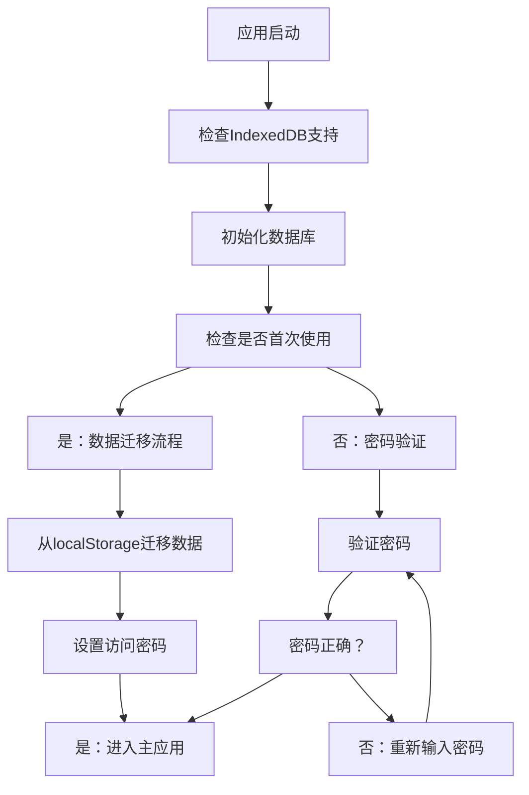
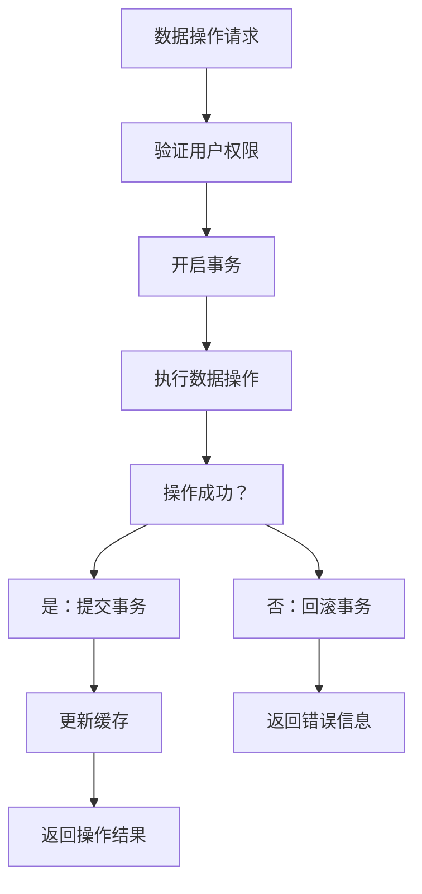
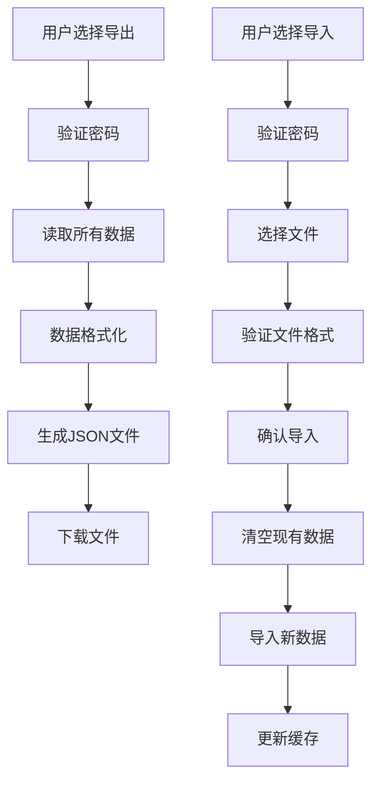
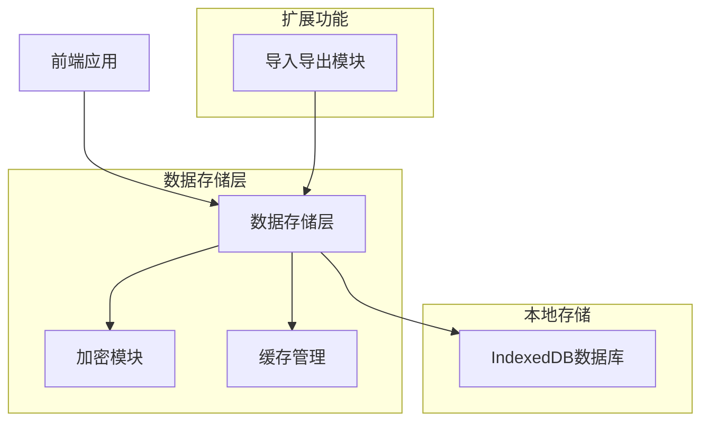
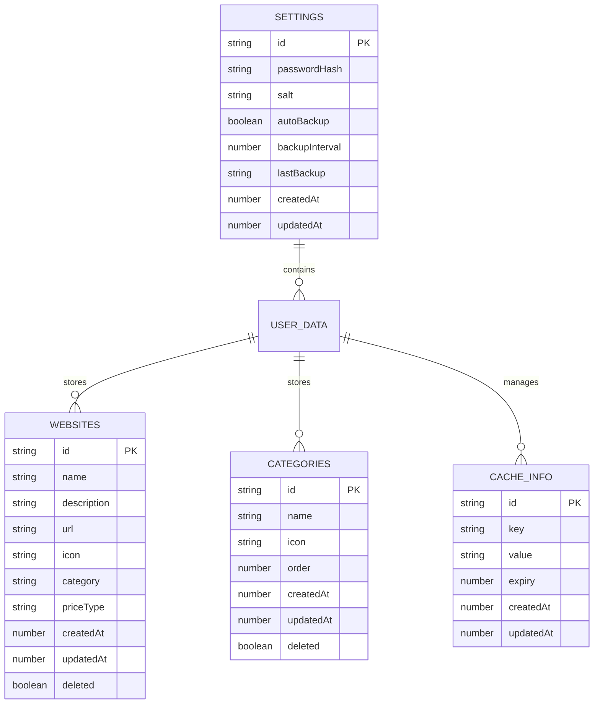

# IndexedDB数据存储架构设计

## 1. 项目概述

本文档设计了一个简洁高效的IndexedDB本地数据存储解决方案，用于替换当前基于localStorage的数据存储实现。该方案专注于本地存储功能，提供密码保护、数据导入导出、数据迁移和性能优化功能。

## 2. 核心功能

### 2.1 功能模块

我们的IndexedDB存储方案包含以下核心模块：

1. **数据库管理模块**：IndexedDB数据库初始化、版本管理、数据迁移
2. **安全认证模块**：本地密码设置、验证、数据加密存储
3. **数据操作模块**：CRUD操作、缓存管理、性能优化
4. **导入导出模块**：数据备份、恢复、格式转换

### 2.2 功能详情

| 模块名称  | 功能名称   | 功能描述                          |
| ----- | ------ | ----------------------------- |
| 数据库管理 | 数据库初始化 | 创建IndexedDB数据库，定义对象存储和索引      |
| 数据库管理 | 版本管理   | 处理数据库版本升级和结构变更                |
| 数据库管理 | 数据迁移   | 从localStorage迁移现有数据到IndexedDB |
| 安全认证  | 密码设置   | 用户首次设置访问密码                    |
| 安全认证  | 密码验证   | 验证用户输入的密码                     |
| 安全认证  | 数据加密   | 对敏感数据进行AES加密存储                |
| 数据操作  | 增删改查   | 提供完整的数据CRUD操作接口               |
| 数据操作  | 缓存管理   | 智能缓存策略，提升数据访问性能               |
| 数据操作  | 事务处理   | 确保数据操作的原子性和一致性                |
| 导入导出  | 数据导出   | 将数据导出为JSON格式文件                |
| 导入导出  | 数据导入   | 从JSON文件导入数据并验证格式              |
| 导入导出  | 备份恢复   | 自动备份和手动恢复功能                   |

## 3. 核心流程

### 3.1 系统初始化流程



### 3.2 数据操作流程



### 3.3 导入导出流程



## 4. 用户界面设计

### 4.1 设计风格

* **主色调**：#2563eb（蓝色）、#10b981（绿色）、#ef4444（红色）

* **按钮样式**：圆角卡片式设计，带阴影效果

* **字体**：系统默认字体，14px-16px主要文字

* **布局风格**：现代化卡片布局，响应式设计

* **图标风格**：使用Emoji图标和SVG图标结合

### 4.2 界面设计概览

| 界面名称   | 模块名称 | UI元素                     |
| ------ | ---- | ------------------------ |
| 密码设置界面 | 安全认证 | 密码输入框、确认密码框、设置按钮，现代化表单设计 |
| 密码验证界面 | 安全认证 | 密码输入框、验证按钮，居中卡片布局 |
| 数据管理界面 | 导入导出 | 导出按钮、导入按钮、备份列表，操作按钮带图标   |
| 设置界面   | 系统设置 | 密码修改、自动备份开关，分组卡片布局  |

### 4.3 响应式设计

* **桌面优先**：主要针对桌面浏览器优化

* **移动适配**：支持移动设备访问，触摸友好的交互设计

* **断点设置**：768px、1024px、1440px三个主要断点

## 5. 技术架构

### 5.1 架构设计



### 5.2 技术栈

* **前端**：原生JavaScript ES6+ + IndexedDB API

* **加密**：Web Crypto API (AES-GCM)

* **文件处理**：File API + Blob API

* **UI框架**：无框架，原生DOM操作

### 5.3 数据库设计

#### 5.3.1 数据库结构



#### 5.3.2 数据定义语言

**数据库初始化**

```javascript
// 创建数据库
const dbRequest = indexedDB.open('NavigationDB', 1);

dbRequest.onupgradeneeded = function(event) {
    const db = event.target.result;
    
    // 创建设置存储
    const settingsStore = db.createObjectStore('settings', { keyPath: 'id' });
    
    // 创建网站存储
    const websitesStore = db.createObjectStore('websites', { keyPath: 'id' });
    websitesStore.createIndex('category', 'category', { unique: false });
    websitesStore.createIndex('name', 'name', { unique: false });
    websitesStore.createIndex('updatedAt', 'updatedAt', { unique: false });
    
    // 创建分类存储
    const categoriesStore = db.createObjectStore('categories', { keyPath: 'id' });
    categoriesStore.createIndex('order', 'order', { unique: false });
    
    // 创建缓存存储
    const cacheStore = db.createObjectStore('cache', { keyPath: 'id' });
    cacheStore.createIndex('key', 'key', { unique: true });
    cacheStore.createIndex('expiry', 'expiry', { unique: false });
};
```

**初始数据插入**

```javascript
// 初始化默认设置
const defaultSettings = {
    id: 'main',
    passwordHash: null,
    salt: null,
    autoBackup: true,
    backupInterval: 7 * 24 * 60 * 60 * 1000, // 7天
    lastBackup: null,
    createdAt: Date.now(),
    updatedAt: Date.now()
};

// 初始化默认分类
const defaultCategories = [
    { id: 'all', name: '全部', icon: '📋', order: 0, createdAt: Date.now(), updatedAt: Date.now(), deleted: false },
    { id: 'search', name: '搜索引擎', icon: '🔍', order: 1, createdAt: Date.now(), updatedAt: Date.now(), deleted: false },
    { id: 'social', name: '社交媒体', icon: '💬', order: 2, createdAt: Date.now(), updatedAt: Date.now(), deleted: false }
];
```

## 6. API接口设计

### 6.1 核心数据操作API

```javascript
// 数据库管理类
class NavigationDB {
    // 初始化数据库
    async init()
    
    // 密码相关
    async setPassword(password)
    async verifyPassword(password)
    async changePassword(oldPassword, newPassword)
    
    // 网站数据操作
    async getWebsites(category = null)
    async addWebsite(websiteData)
    async updateWebsite(id, websiteData)
    async deleteWebsite(id)
    
    // 分类数据操作
    async getCategories()
    async addCategory(categoryData)
    async updateCategory(id, categoryData)
    async deleteCategory(id)
    
    // 缓存操作
    async getCache(key)
    async setCache(key, value, expiry)
    async clearExpiredCache()
    
    // 导入导出
    async exportData()
    async importData(jsonData)
    
    // 数据迁移
    async migrateFromLocalStorage()
}
```

### 6.2 加密工具API

```javascript
// 加密工具类
class CryptoUtils {
    // 生成密码哈希
    static async hashPassword(password, salt)
    
    // 生成随机盐值
    static generateSalt()
    
    // 数据加密
    static async encryptData(data, password)
    
    // 数据解密
    static async decryptData(encryptedData, password)
    
    // 生成密钥
    static async deriveKey(password, salt)
}
```

### 6.3 导入导出API

```javascript
// 导入导出工具类
class DataManager {
    // 导出数据到文件
    static async exportToFile(data, filename)
    
    // 从文件导入数据
    static async importFromFile(file)
    
    // 验证数据格式
    static validateImportData(data)
    
    // 数据格式转换
    static convertLegacyData(legacyData)
    
    // 创建备份
    static async createBackup()
    
    // 恢复备份
    static async restoreBackup(backupData)
}
```

## 7. 安全方案

### 7.1 密码安全

* **密码哈希**：使用PBKDF2算法，迭代次数100,000次

* **盐值生成**：每个用户使用唯一的随机盐值

* **密码强度**：要求至少8位，包含字母和数字

* **会话管理**：密码验证后设置会话超时（30分钟无操作自动锁定）

### 7.2 数据加密

* **加密算法**：AES-GCM 256位加密

* **密钥派生**：基于用户密码和盐值派生加密密钥

* **数据完整性**：使用HMAC验证数据完整性

* **敏感数据**：网站URL、描述等敏感信息进行加密存储

### 7.3 访问控制

* **权限验证**：所有数据操作前验证用户权限

* **操作日志**：记录关键操作日志（可选）

* **防暴力破解**：密码错误次数限制，临时锁定功能

* **数据隔离**：不同用户数据完全隔离

## 8. 性能优化

### 8.1 数据库优化

* **索引策略**：为常用查询字段创建索引

* **事务优化**：批量操作使用单个事务

* **连接池**：复用数据库连接，减少开销

* **查询优化**：使用游标进行大数据量查询

### 8.2 缓存策略

* **内存缓存**：热点数据保存在内存中

* **缓存过期**：智能缓存过期策略

* **预加载**：预加载常用数据

* **懒加载**：按需加载非关键数据

### 8.3 用户体验优化

* **异步操作**：所有数据库操作异步执行

* **加载状态**：显示操作进度和加载状态

* **错误处理**：友好的错误提示和恢复机制

* **离线支持**：完全离线可用的数据存储

## 9. 实施计划

### 9.1 开发阶段

1. **第一阶段**：IndexedDB基础架构搭建（2-3天）
2. **第二阶段**：数据迁移和密码保护实现（2-3天）
3. **第三阶段**：导入导出功能开发（1-2天）
4. **第四阶段**：UI界面优化和用户体验提升（1-2天）
5. **第五阶段**：测试和优化（1-2天）

### 9.2 测试计划

* **单元测试**：核心功能模块测试

* **集成测试**：数据迁移和导入导出测试

* **性能测试**：大数据量操作性能测试

* **安全测试**：密码保护和数据加密测试

* **兼容性测试**：不同浏览器兼容性测试

### 9.3 部署策略

* **渐进式部署**：先在测试环境验证，再逐步推广

* **数据备份**：部署前自动备份现有数据

* **回滚机制**：出现问题时快速回滚到localStorage版本

* **用户引导**：提供详细的功能使用指南

## 10. 未来扩展

### 10.1 性能优化

* **数据压缩**：对大量数据进行压缩存储

* **智能缓存**：更智能的缓存策略和预加载机制

* **批量操作**：优化批量数据操作性能

* **内存管理**：更好的内存使用和垃圾回收

### 10.2 功能增强

* **数据搜索**：全文搜索和高级筛选功能

* **数据统计**：使用习惯分析和数据统计

* **主题定制**：用户界面主题和布局定制

* **快捷操作**：键盘快捷键和批量操作

### 10.3 扩展接口

* **插件系统**：支持第三方插件扩展

* **导入格式**：支持更多数据格式导入

* **API接口**：为未来的远程同步预留接口

* **数据验证**：更严格的数据完整性验证

